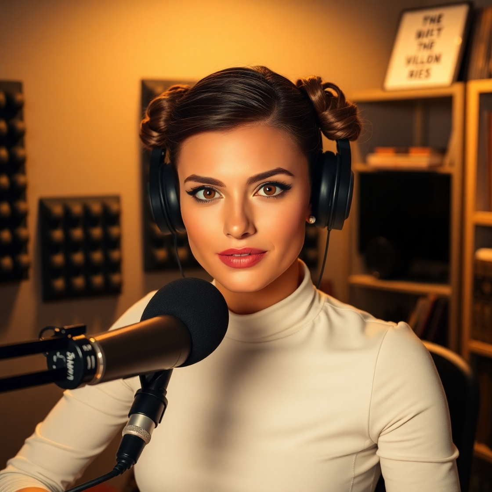

<a href="https://dio.me/">
    

    Preview do podcast

    <audio src="output/O Guia da Fortuna Galáctica .MP3" controls title="Podcast editado"></audio>

# Projeto Podcast Gerado por I.A.s
Projeto com o objetivo de gerar um podcast utilizando ferramentas de IA através de prompts mais trabalhados, para o desafio de projeto " Criando um Podcast com IAs Generativas" 

Utilizei uma esteira de prompts para gerar cada etapa do processo criativo.

## 💻 Tecnologias utilizadas no projeto

- [ChatGPT](https://chat.openai.com/) 
- [Leonardo AI](https://app.leonardo.ai/image-generation)
- [ElevenLabs](https://beta.elevenlabs.io/)
- [Capcut](https://www.capcut.com/pt-br/)

## ✨ Como foi feito ?

- Roteiro gerado via chatgpt
- Audio gerado pela elevenLabs
- Leonardo AI Para gerar capa
- Capcut para tratar aúdio e adicionar sons de fundo
